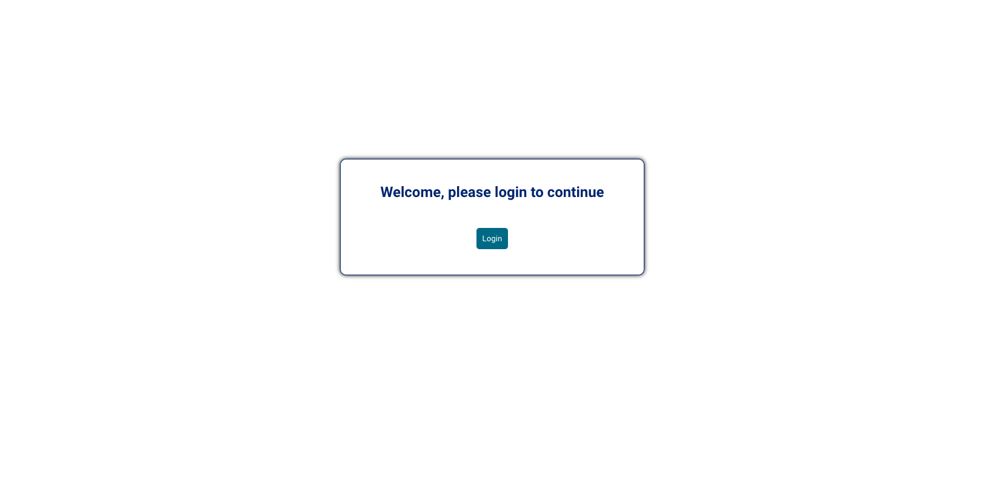
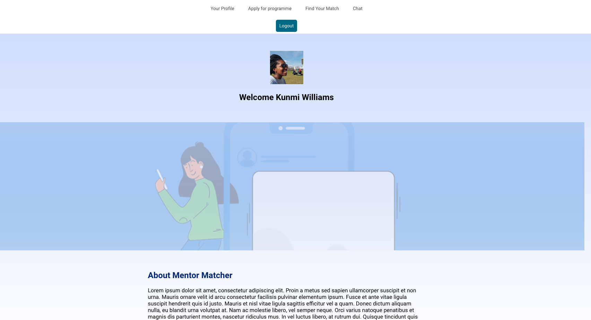
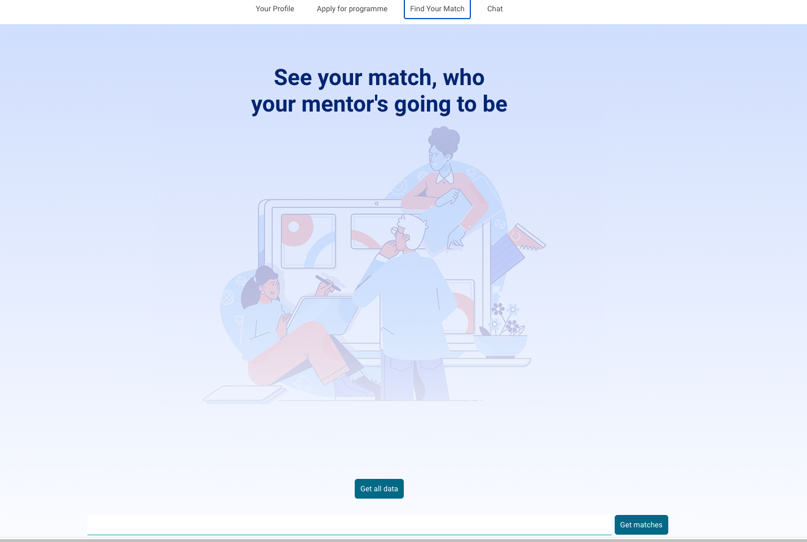

# Mentor Matcher

**School of Code Bootcamp - Week 8 Project**

##### November 2020

This app is the product of a week long project. I worked in an agile team of five developers. We were given the brief: "Build an app that will enhance the mentoring experience". Our solution aimed to improve compatibility matching between mentor and mentee. We allocated a day for planning and we used Trello and Draw.io. We had a short three day coding sprint. On the last day we presented our apps to an employee panel.

#### The Problem

- Matching mentors and mentees was time consuming for coaches.
- The pairings where random which led to mismatches.

#### The Solution

- We removed coaches from the equation by creating a platform where mentors and mentees could sign up using our in-built forms
- To combat random pairings, matches where based on Myers Briggs personality types. So you can either choose a pair who is the same personality type or the opposite, to challenge your thinking.

## Take a look

Mentor Matcher is hosted on Netlify:

### Tech Stack: 
HTML, CSS, JavaScript, React, Express.js, Node.js, PostgreSQL, Auth0, Trello. Cloud hosted using Heroku and Netlify.

## App

## Main learnings:

- Communication is key. We did well communicating during the day but work completed out of hours didn't always get communicated to the team and this created confusion. I was appointed project manager on day 2 to try and improve our agile team work and communication.

- The power of Git and Github it was cool seeing how making branches etc can make working on the same project much easier.

- Better understanding of Agile way of work. As the week went on the team made more use of stand ups and retros to guide our next steps.

- We did independant research and were able to implement Authentication and Authorisation using Auth0. It was great using our problem solving skills to unpick the docs and get something we hadn't been taught yet to work.

- Created a presentation and had to articulate our whole process from ideation, planning, the build and future plans. I was happy our live demo of the app went well.

## Stretch goals:

- Implementing testing thoughout the frontend and backend.
- Chat room using web sockets where matched mentors and mentees can get to know each other.
- Implement matching based on multiple categories e.g industry experience, interests.
- Improve the user profiles to allow for editing and updating of information.
