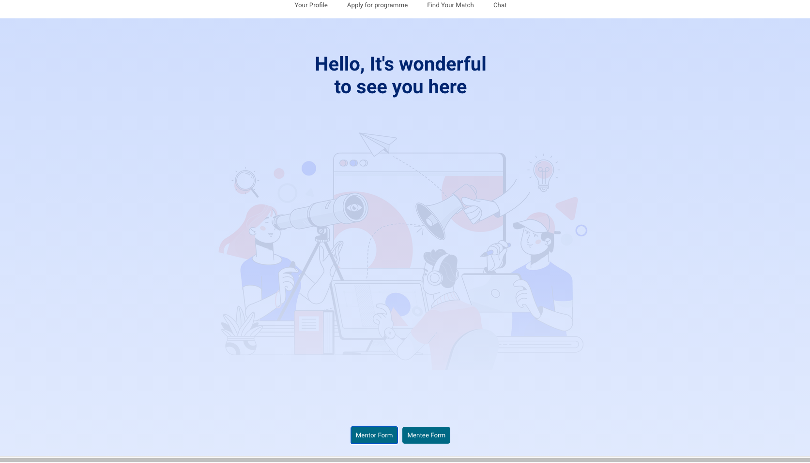

# Mentor Matcher

**School of Code - Week 8 Project**

##### November 2020

This app is the product of a week long project. I worked in an agile team of five developers. I was voted as Project Manager for the week and I helped keep the group on track by managing our retros and stand ups, as well as resolving any conflicts that came up. We were given the brief: **"Build an app that will enhance the mentoring experience"** Our solution aimed to improve compatibility matching between mentor and mentee. We allocated a day for planning and we used Trello and Draw.io to map out initial ideas. We had a short three day coding sprint and on the last day we presented our app to an employee panel.

#### The Problem

- Matching mentors and mentees was time consuming for coaches.
- The pairings where random which led to mismatches.

#### The Solution

- We removed coaches from the equation by creating a platform where mentors and mentees could sign up using our in-built forms
- To combat random pairings, matches where based on Myers Briggs personality types. So you can either choose a pair who is the same personality type or the opposite, to challenge your thinking.

**Tech Stack:** HTML, CSS, JavaScript, React,JSX, dotenv, Express.js, Node.js, PostgreSQL, Auth0, Cloud hosted using Heroku and Netlify.

## Take a look

Mentor Matcher is hosted on Netlify: https://mentor-matcher.netlify.app

[Frontend Repo](https://github.com/kumsw/mentor-matcher-front-end) 
[Backend Repo](https://github.com/kumsw/mentor-matcher-back-end) 

## To Start

Clone the the frontend and backend repos. Download and install npm modules for both front and backend repos. Add .env files for local usage You will need a postgres database to store data.

## Installation

1.  Clone the frontend 
    `https://github.com/kumsw/mentor-matcher-front-end` 
2.  Clone the backend 
    `https://github.com/kumsw/mentor-matcher-back-end` 
3.  Download the required npm modules in both repos. 
    `npm i` 
4.  Add a .env file in the root of the frontend folder with the entry 
    `REACT_APP_BACKEND_URL=http://www.localhost:5000` 
    `REACT_APP_AUTH0_DOMAIN={YOUR AUTH0 CREDENTIALS}` 
    `REACT_APP_AUTH0_CLIENT_ID={YOUR AUTH0 CREDENTIALS}` 
5.  Add a .env file in the root of the backend folder with the entry 
    `DATABASE_URL` 
6.  Run the createMentorTable.js and createMenteeTable.js script from the backend folder. 
    `npm run createMentorTable` 
    `npm run createMenteeTable` 
7.  Run the teePopulateTable.js and torPopulateTable.js script from the backend folder. 
    `npm run teePopulateTable` 
    `npm run torPopulateTable` 
8.  Open a terminal and start the backend and frontend using: 
    `npm run start` 

## App desktop view

## Usage

This app consits of three pages. After login the user is directed to thier login page. Depending on the role of the user they should navigate to the **_apply for programme_** tab where they can fill in the respective mentor or mentee form and then get added to the database. 
The user can then navigate to the **_find your match page_** where they can input thier personality type or the opposite type and get a list of thier matches.

## Main learnings:

- The power of Git and Github it was cool seeing how making branches etc can make working on the same project much easier.

- Better understanding of Agile way of work. As the week went on the team made more use of stand ups and retros to guide our next steps.

- We did independant research and were able to implement Authentication and Authorisation using Auth0. It was great using our problem solving skills to unpick the docs and get something we hadn't been taught yet to work.

- Created a presentation and had to articulate our whole process from ideation, planning, the build and future plans. I was happy our live demo of the app went well.

## Stretch goals:

- Implementing testing thoughout the frontend and backend.
- Chat room using web sockets where matched mentors and mentees can get to know each other.
- Implement matching based on multiple categories e.g industry experience, interests.
- Improve the user profiles to allow for editing and updating of information.
